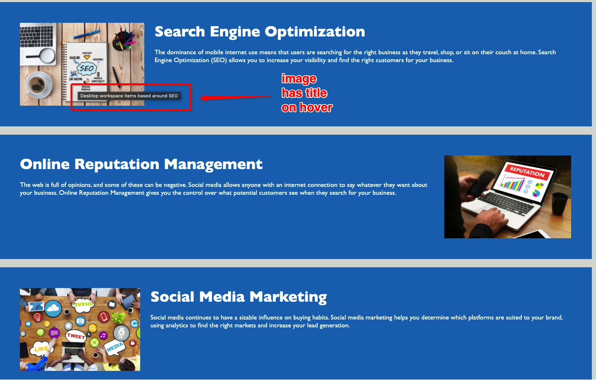

# Horiseon Accessibility Refactor

## Description

Horiseon Marketing Agency was looking for a way to make their user experience more accessible. This is the code refactor with comments to describe all action taken in improving the code.

This was done utilizing the provided html and css code already functioning on their website. The refactor allowed for this code to be condensed and organized where applicable. It allows others to read the code more easily, as it eliminates redundant items and allows code to flow cleanly.

During the course of this project I was able to learn to accurately read the code provided to me to see what actions it preformed, then take that code and make small changes to improve functionality. For example, if we had multiple classes that could function as one singular class and be applied to all utilizing parties, I was able to do that. I was able to see the importance of being able to read code before trying to write and/or edit it. The biggest thing I took away from this project is how easy it is to change multiple things in a file, but the final product continues to look same. There are so many changes I made to improve the cleanliness of the code, yet the webpage will keep it's design.

## Table of Contents (Optional)

- [Installation](#installation)
- [Usage](#usage)
- [Credits](#credits)
- [License](#license)

## Installation

You do not need anything to install this project, unless you do not already have Visual Studio Code or another text editor. If you clone the repository, you should be able to pull up the index.html file as well as open the app inside of a broswer to see the code executed.

## Usage

You can view this here:
https://haleighspurlock.github.io/horiseon-accessibility-refactor/

Utilize the Navigation Bar to move to the selection section

If you hover over any image on the page, text will display telling you what the picture is

## Credits

Choosing a License for this project: https://choosealicense.com/licenses/mit/

## License

MIT License

Copyright (c) [2021] [HaleighSpurlock]

Permission is hereby granted, free of charge, to any person obtaining a copy
of this software and associated documentation files (the "Software"), to deal
in the Software without restriction, including without limitation the rights
to use, copy, modify, merge, publish, distribute, sublicense, and/or sell
copies of the Software, and to permit persons to whom the Software is
furnished to do so, subject to the following conditions:

The above copyright notice and this permission notice shall be included in all
copies or substantial portions of the Software.

THE SOFTWARE IS PROVIDED "AS IS", WITHOUT WARRANTY OF ANY KIND, EXPRESS OR
IMPLIED, INCLUDING BUT NOT LIMITED TO THE WARRANTIES OF MERCHANTABILITY,
FITNESS FOR A PARTICULAR PURPOSE AND NONINFRINGEMENT. IN NO EVENT SHALL THE
AUTHORS OR COPYRIGHT HOLDERS BE LIABLE FOR ANY CLAIM, DAMAGES OR OTHER
LIABILITY, WHETHER IN AN ACTION OF CONTRACT, TORT OR OTHERWISE, ARISING FROM,
OUT OF OR IN CONNECTION WITH THE SOFTWARE OR THE USE OR OTHER DEALINGS IN THE
SOFTWARE.
